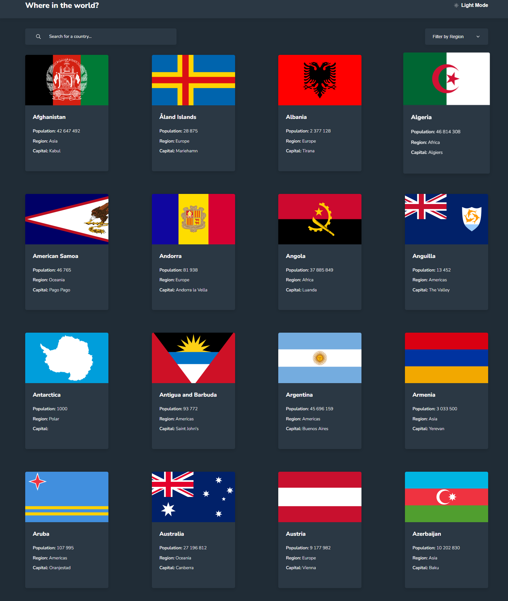
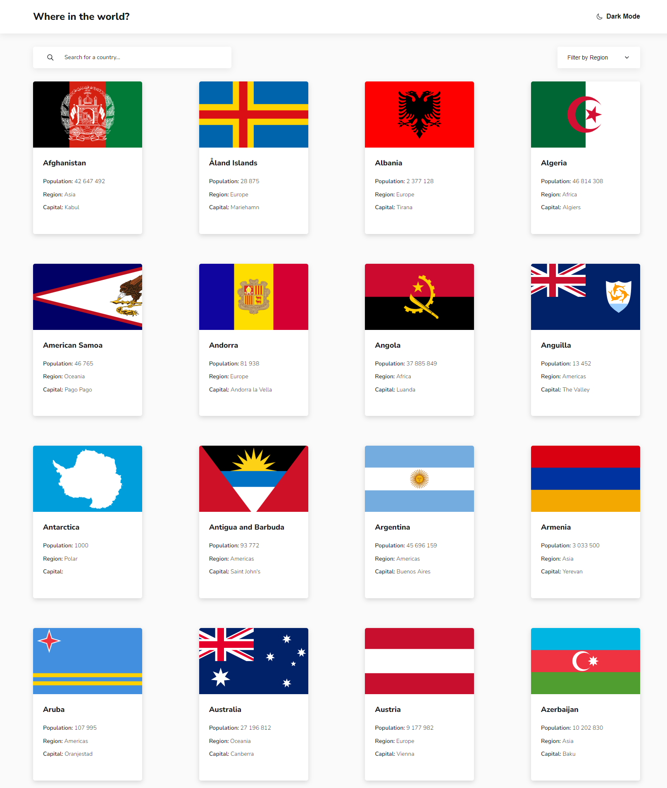
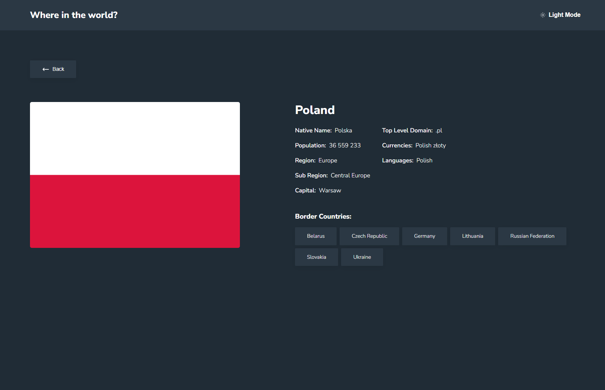

# Frontend Mentor - REST Countries API with color theme switcher solution

This is a solution to the [REST Countries API with color theme switcher challenge on Frontend Mentor](https://www.frontendmentor.io/challenges/rest-countries-api-with-color-theme-switcher-5cacc469fec04111f7b848ca)

## Table of contents

- [Overview](#overview)
  - [The challenge](#the-challenge)
  - [Screenshots](#screenshots)
  - [Links](#links)
- [My process](#my-process)
  - [Built with](#built-with)
  - [What I learned](#what-i-learned)
  - [AI Collaboration](#ai-collaboration)
- [Author](#author)

## Overview

### The challenge

Users are able to:

- See all countries from the data on the homepage
- Search for a country using an `input` field
- Filter countries by region
- Click on a country to see more detailed information on a separate page
- Click through to the border countries on the detail page
- Toggle the color scheme between light and dark mode

### Screenshots

Dark theme:



Light theme:



Separated page with more detailed information about selected country:



### Links

- Solution URL: [https://github.com/Nosiu01/rest-countries-api.git](https://github.com/Nosiu01/rest-countries-api.git)
- Live Site URL: [https://nosiu01.github.io/rest-countries-api/](https://nosiu01.github.io/rest-countries-api/)

## My process

### Built with

- Semantic HTML5
- CSS
- Flexbox
- SASS
- Mobile-first workflow
- [React.js](https://reactjs.org/) - JS library
- [Vite](https://vite.dev/) - Frontend Tooling
- [Figma](https://www.figma.com/) 

### What I learned

During the project, I learned how to use Sass with Vite, using it to create text presets and animated transitions.
I also continued learning how to work with Figma files.

```scss
// typography.scss
@mixin text-preset-2 {
	font-weight: 800;
	font-size: 24px;
	line-height: 137.5%;
	letter-spacing: 0px;
}

// anotherFile.scss
@use '../typography.scss' as *;

.text-header {
	@include text-preset-2;
}
```

### AI Collaboration

I used AI to help me create well-structured components and to learn and better understand Sass, which I was then able to implement into the project.

## Author

- Frontend Mentor - [@Nosiu01](https://www.frontendmentor.io/profile/Nosiu01)
